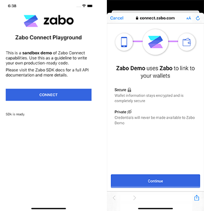

What is Zabo? A unified cryptocurrency API.
=========================
[](https://circleci.com/gh/zabo-api/zabo-sdk-react-native/tree/master)
[](https://discord.gg/vGHYuUT)
[](https://forum.zabo.com)   

[Zabo](https://zabo.com) is an API for connecting with cryptocurrency exchanges, wallets and protocols like Bitcoin. Instead of manually integrating with [Coinbase API](https://zabo.com/integrations/coinbase), [Binance API](https://zabo.com/integrations/binance), [Bitcoin APIs](https://zabo.com/integrations/bitcoin) or the hundreds of other cryptocurrency APIs - you can simply use Zabo for them all.  

We believe teams and developers should focus on building great products, not worry about the fragmented landscape of exchange APIs and blockchain protocols.  

For our updated list of integrations, [check out our Zabo integrations](https://zabo.com/integrations).

# Zabo API React Native SDK

The Zabo SDK for React Native provides convenient access to the Zabo API for mobile applications.  

Please keep in mind that [you must register](https://zabo.com/login) and receive a team id to use in your client application, or if you are using the server side functions, [generate an API keypair from your dashboard](https://zabo.com/dashboard).



## Documentation
See the [Zabo API docs](https://zabo.com/docs).

## Requirements
- React Native >= 0.62

## Installation
```
npm install zabo-sdk-react-native --save
```

**iOS Platform:**
Install pod
```
cd ios && pod install && cd ..
```

**Android Platform:**
You are set!

## Configuration
Zabo SDK React Native was inspired in the library [React Native In App Browser](https://github.com/proyecto26/react-native-inappbrowser). 

It supports [Chrome Custom Tabs](https://developer.chrome.com/docs/android/custom-tabs/overview/#whatarethey) for Android and [SafariServices](https://developer.apple.com/documentation/safariservices)/[AuthenticationServices](https://developer.apple.com/documentation/authenticationservices) for iOS.

Some extra configuration are necessary:

### Configure Android Launch Mode (REQUIRED)
Configure Application launch mode as single task:

AndroidManifest.xml
```XML
<application
  ...
  android:launchMode="singleTask">
  ...
</application>
```

### Configure Deep Linking (RECOMMENDED)
zabo-sdk-react-native uses websocket to receive the connection success or connection error callbacks in the app. You can configure a custom link scheme to your app in order to have a better user experience.

**1. Enable Deep Linking in your app:** 
Follow the instructions at [React Native Linking](https://reactnative.dev/docs/linking#enabling-deep-links) documentation. You can create any scheme you desire. We are using `zabo-app`in our examples.

**iOS example:**
AppDelegate.m
```objectivec
#import <React/RCTLinkingManager.h>

- (BOOL)application:(UIApplication *)application
   openURL:(NSURL *)url
   options:(NSDictionary<UIApplicationOpenURLOptionsKey,id> *)options
{
  return [RCTLinkingManager application:application openURL:url options:options];
}
```

Info.plist
```XML
<key>CFBundleURLTypes</key>
<array>
  <dict>
    <key>CFBundleTypeRole</key>
    <string>Editor</string>
    <key>CFBundleURLName</key>
    <string>com.myApp</string>
    <key>CFBundleURLSchemes</key>
    <array>
      <string>zabo-app</string>
    </array>
  </dict>
</array>
```

**Android example:**
AndroidManifest.xml
```XML
<activity>
  ...
  <intent-filter>
    <action android:name="android.intent.action.VIEW" />
    <category android:name="android.intent.category.DEFAULT" />
    <category android:name="android.intent.category.BROWSABLE" />
    <data android:scheme="zabo-app" android:host="connected" android:pathPrefix="" />
  </intent-filter>
<activity>
```


**2. Configure Redirect URI:** 
On login success, the Connect Widget will call back the redirect URI `zabo-app://connected` with the account data. In this case, you should configure this redirect URI in your account on Zabo console:


## Usage
### Zabo.init() parameters
| Param      | Default                  | Description                                                                             | Required |
|------------|--------------------------|-----------------------------------------------------------------------------------------|----------|
| clientId   |                          | App Key acquired when registering a team in  [Zabo Dashboard](https://zabo.com/login/). | Yes      |
| env        |                          | `sandbox` or `live`                                                                     | Yes      |
| apiVersion | v1                       | `v0` or `v1`                                                                            | No       |

### zabo.connect() parameters (Optional)
| Param        | Default                  | Description                              | Required |
|--------------|--------------------------|------------------------------------------|----------|
| redirect_uri |                          | Url to be redirected after login success | No       |
| origin       | zabo-sdk-react-native    | Identification of connection origin      | No       |

### Example
```JS
import React, { useEffect, useState } from 'react'
import { SafeAreaView, StyleSheet, ScrollView, View, Text, TouchableOpacity } from 'react-native'
import Zabo from 'zabo-sdk-react-native'

const App = () => {
  const [output, setOutput] = useState(null)

  useEffect(() => {
    setOutput('Loading SDk...')

    const init = async () => {
      try {
        await Zabo.init({
          clientId: 'YOUR_CLIENT_ID',
          env: 'sandbox',
          apiVersion: 'v1'
        })

        setOutput('SDk is ready')
      } catch (err) {
        setOutput(`ERROR:\n${JSON.stringify(err)}`)
      }
    }

    init()
  }, [])

  const handleConnect = () => {
    const zabo = Zabo.instance
    const params = {
      redirect_uri: 'zabo-app://connected', // RECOMMENDED
      origin: 'zabo-app'                    // RECOMMENDED
    }
    zabo.connect({ params }).onConnection(account => {
      setOutput(`CONNECTED!\nACCOUNT:\n${JSON.stringify(account)}`)
    }).onError(err => {
      setOutput(`ERROR:\n${JSON.stringify(err)}`)
    })
  }

  return (
    <>
      <SafeAreaView>
        <ScrollView>
          <View style={styles.sectionContainer}>
            <TouchableOpacity onPress={handleConnect} style={styles.button}>
              <Text style={styles.buttonText}>CONNECT</Text>
            </TouchableOpacity>
          </View>
          {output &&
            <View style={styles.sectionContainer}>
              <Text>{output}</Text>
            </View>}
        </ScrollView>
      </SafeAreaView>
    </>
  )
}

const styles = StyleSheet.create({
  sectionContainer: { marginTop: 32, paddingHorizontal: 24 },
  button: { backgroundColor: '#3465E0', marginVertical: 16, padding: 16, alignItems: 'center' },
  buttonText: { fontSize: 16, fontWeight: '600', color: '#fff' }
})

export default App
```

### After connecting
```js
zabo.transactions.getList({ ticker: 'ETH' }).then(history => {
  console.log(history)
}).catch(error => {
  /* User has not yet connected */
  console.error(error)
})
```

### Using Promises
Every method returns a chainable promise which can be used:
```js
zabo.getTeam().then(a => {
  console.log(a)
}).catch(e => {
  console.log(e.message)
})
```
Or with async/await:
```js
let exchangeRates = await zabo.currencies.exchangeRates()
console.log(exchangeRates)
```

## Help and Further Information
Please [read our docs](https://zabo.com/docs) and reach out to us in any or all of the following forums for questions:

* [Discord](https://discord.gg/vGHYuUT)
* [Discourse](https://forum.zabo.com)
* [Gitter](https://gitter.im/zabo-api/community)
* [Email](mailto:contact@zabo.com)

## Issues
If you notice any issues with our docs, this README, or the SDK, feel free to open an issue and/or a PR. We welcome community contributions!
